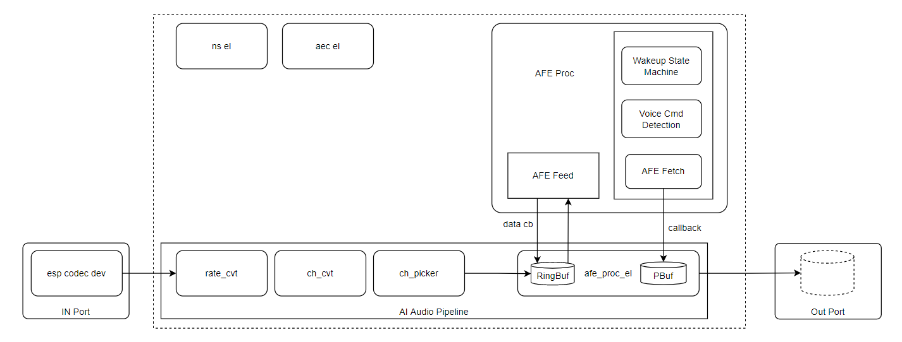

# AI Audio

提供：

- 基于 IDF 的 `afe_proc`, 管理 afe 的数据输入输出，唤醒状态，命令词检测
- 基于 GMF 的 `esp_gmf_ch_picker`, 用来处理pcm数据通道的选择和排序。
- 基于 GMF 的 `esp_gmf_afe_proc` element, 提供在 GMF pipeline 中使用 afe_proc 的组件。
- 基于 GMF 的 `esp_gmf_aec` element, 单独使用 esp-sr 中的 aec，提供在 GMF pipeline 中使用的 AEC 组件。
- 基于 GMF 的 `esp_gmf_ns` element, 单独使用 esp-sr 中的 ns，提供在 GMF pipeline 中使用的 NS 组件。
- 基于 GMF 的 `ai_audio`, high level API, 封装了GMF Pipeline的创建于管理, 封装了 afe_proc 的操作。

## 总体结构



### afe_proc

- 管理 feed & fetch task
- 管理唤醒和人声检测状态机，提供vad防抖
- 命令词检测
- 统一的事件接口

```c
typedef struct {

    /**
    * @brief AI audio event type
    */
    enum {
        WAKEUP_START = -100, /*!< Wakeup start */
        WAKEUP_END,          /*!< Wakeup stop */
        VAD_START,           /*!< Vad start */
        VAD_END,             /*!< Vad stop */
        VCMD_DECT_TIMEOUT,
        VCMD_DECTECTED = 0   /*!< Form 0 is the id of the voice commands detected by Multinet*/
        /* DO NOT add items below this line */
    } type;                  /*!< Event type */
    void *event_data;        /*!< Event data */
    size_t data_len;         /*!< Length of event data */
} ai_audio_evt_t;
```

### esp_gmf_ch_picker

- 使用字符串方式来配置, 如: "1,3,0" 或者 "0,3|1"
- "|" 表述分组
- "," 表述组内的通道号

Input PCM data:
Sample 0: 1 11 21 31
Sample 1: 2 12 22 32
Sample 2: 3 13 23 33
Sample 3: 4 14 24 34
Sample 4: 5 15 25 35

- 排列字符串 "1,3,0"：

> 11 31 1 12 32 2 13 33 3 14 34 4 15 35 5

- 排列字符串 "1,3|0"：

> 11 31 12 32 13 33 14 34 15 35 1 2 3 4 5

### ai_audio

组合pipeline，提供全面的配置和简单的接口，方便集成到实际工程中。

### 初始化示例

```c
afe_config_t afe_cfg = AFE_CONFIG_DEFAULT();
ai_audio_cfg_t ai_aud_cfg = DEFAULT_AI_AUDIO_CFG();
ai_aud_cfg.src_info.sample_rate = DEFAULT_SAMPLERATE;
ai_aud_cfg.afe_cfg = &afe_cfg;
ai_aud_cfg.wakeup_det = true;
ai_aud_cfg.wakeup_end = 2000;
ai_aud_cfg.vocie_cmd_det = true;
ai_aud_cfg.event_cb = ai_audio_event_cb;
ai_aud_cfg.event_user_ctx = NULL;
ai_aud_cfg.in_port = NEW_ESP_GMF_PORT_IN_BYTE(esp_gmf_io_acquire_read, esp_gmf_io_release_read,
                                                NULL, codec_dev, 2048, ESP_GMF_MAX_DELAY);
ai_aud_cfg.out_port = NEW_ESP_GMF_PORT_OUT_BYTE(ai_audio_acquire_write, ai_audio_release_write,
                                                NULL, NULL, 2048, 100);
ai_audio_create(&ai_aud_cfg, &ai_audio);
```

## Examples

- example/base: 测试基础的afe proc的功能
- example/afe_el_2file: 使用afe_proc_el作为pipeline的一环将 AEC 之后的单channel数据保存到文件
- example/ai_audio: high level api 测试。测试ai audio 功能
